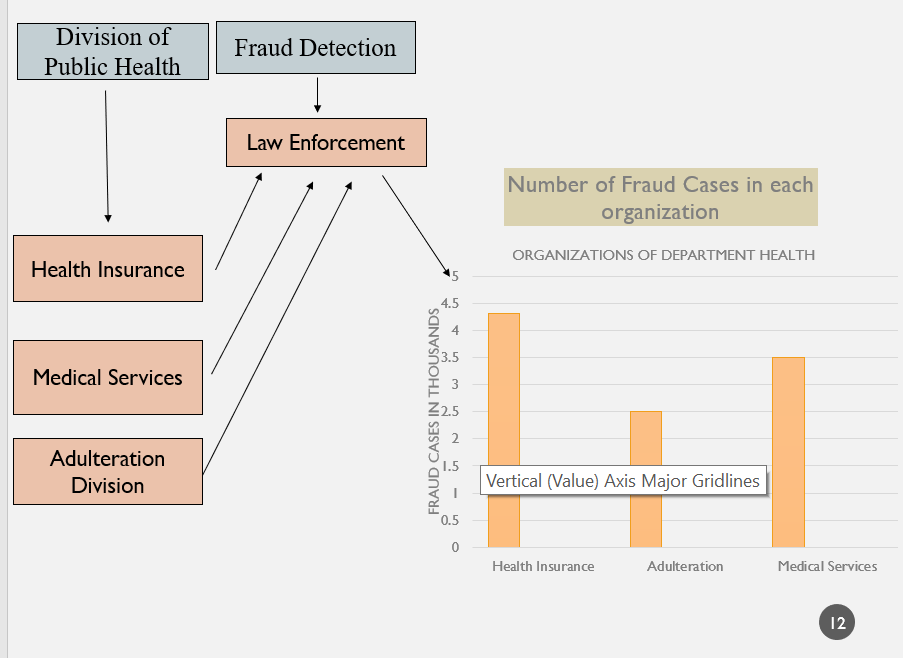

# Medical-Fraud-Detection-System

**Summary:**
- The goal of this project is to detect fraud in medical system and report it to law enforcement agency
- This is achieved by showing the various interdependence among the different components of the project namely the Network layer which is the Government, the Enterprises which consist of the Department of Public Health, Fraud Detection Agency, Hospitals and the Insurance Enterprise
- These enterprises have organizations which interact among each other and  detect the fraud activities caused by any entity.

**Hierarchical model:**

**Enterprises:**
1) **Department of Public Health**

  *Organizations:*
- **Division Of Insurance:** Deals with Insurance related frauds by Insurance companies
- **Division of Adulteration:** Processes medicine adulteration fraud by hospitals
- **Division of Medical Services:** Investigates overcharging of medical treatment and equipments

2) **Fraud Detection Agency**

  *Organizations:*
- **Law Enforcement:** Processes Legal action against Fraudulent Enterprises and fines them accordingly. Also keeps a track of various types of fraud committed

3) **Hospitals**

  *Organizations:*
- **Pharmacy, Patient and Release Of Information:** Internal departments of a hospital to process adulteration complaints and provide patient medical files to Department of Public Health if complaint filed by a patient

4) **Health Insurance:**

  *Organizations:*
- **Claims:** Processes patient insurance documents and provides information to Division Of Insurance if there is an insurance fraud

**Technologies Used:**
1) Java SE
2) Swing
3) Netbeans
4) Object Oriented Programming
5) Design Patterns like Singleton
6) DB4 to persist data in application
7) JFree Chart to display fraud statistics

**Example Use Case**
1) A patient files a complain with the Division of Medical Services organization if he/she feels being defrauded
2) Division of Medical Services will ask for relevant medical files of the patients from Release Of Information organization of the hospital
3) If fraud is detected by the medical services department than work request is forwarded to Law Enforcement who will fine the Hospital
